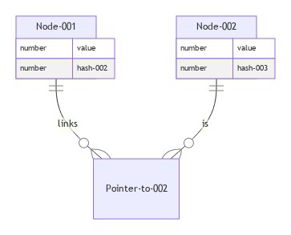
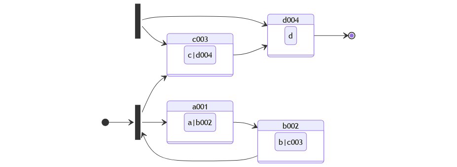
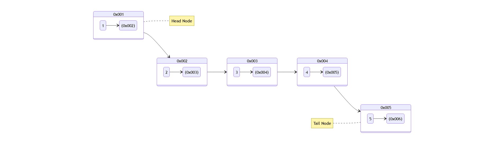
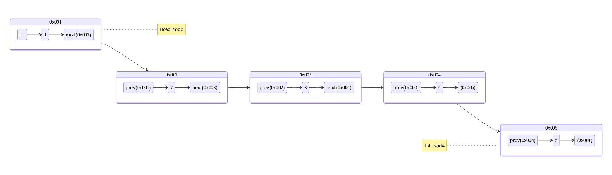
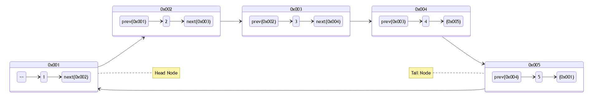
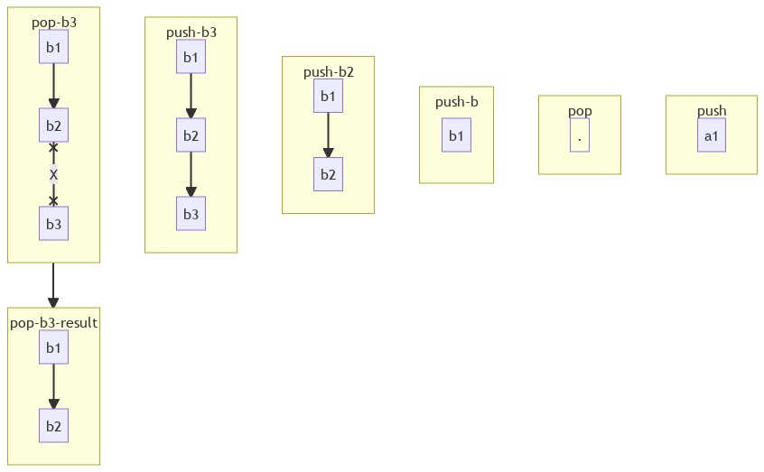

<h1>
Data Structures and Algorithms in JavaScript / TypeScript
</h1>

By: Nasr Galal / @sniperadmin


<h4>
This is the most comprehensive explanation for the data structures and algorithms in TypeScript.

for the best experience, feel free to visit the full page here:
</h4>

[Link for the full page](https://sniperadmin.github.io/js-data-structures-and-algorithms/)

---

# Material contents
- [Material contents](#material-contents)
- [Run Time Analysis](#run-time-analysis)
  - [Time Factor (Time complexity)](#time-factor-time-complexity)
  - [Space Factor (Space complexity)](#space-factor-space-complexity)
- [Notations for Run Time Analysis](#notations-for-run-time-analysis)
  - [Omega Notation !)](#omega-notation-)
  - [Big O notation !)](#big-o-notation-)
  - [Theta notation !)](#theta-notation-)
- [Guided Examples of Run Time Analysis](#guided-examples-of-run-time-analysis)
- [Practical examples for all types](#practical-examples-for-all-types)
  - [Constant time !)](#constant-time-)
  - [Linear time !)](#linear-time-)
  - [Logarithmic Time !)](#logarithmic-time-)
  - [Linear Logarithmic Time: !)](#linear-logarithmic-time-)
  - [Quadratic Time: !)](#quadratic-time-)
  - [Cubic Time: !)](#cubic-time-)
  - [Exponential Time !)](#exponential-time-)
  - [(Example => brute forcing algorithm [Backtracking])](#example--brute-forcing-algorithm-backtracking)
  - [Factorial Time !)](#factorial-time-)
- [Digging deeper in calculation of time complexity](#digging-deeper-in-calculation-of-time-complexity)
  - [Example #1](#example-1)
  - [Example #2](#example-2)
  - [Example #3](#example-3)
  - [Example #4](#example-4)
  - [Example #5](#example-5)
  - [Example #6](#example-6)
  - [Example #7](#example-7)
- [Data Strucutres](#data-strucutres)
  - [Array](#array)
    - [Properties](#properties)
    - [Example](#example)
    - [Types of Array](#types-of-array)
      - [One Dimensional Array](#one-dimensional-array)
      - [Two Dimensional Array](#two-dimensional-array)
    - [How Array is stored in RAM (Random Accessed Memory)](#how-array-is-stored-in-ram-random-accessed-memory)
      - [1D Array](#1d-array)
      - [2D Array](#2d-array)
    - [How to create 1D Array](#how-to-create-1d-array)
    - [Declaration of Array](#declaration-of-array)
    - [Instantiation of Array](#instantiation-of-array)
    - [Initialization of Array](#initialization-of-array)
    - [Searching algorithms](#searching-algorithms)
      - [Linear search](#linear-search)
      - [Binary Search](#binary-search)
    - [2D Arrays](#2d-arrays)
  - [Linked List](#linked-list)
    - [Array stored in memory](#array-stored-in-memory)
    - [Linked List visualization](#linked-list-visualization)
    - [Linked List stored in memory](#linked-list-stored-in-memory)
    - [Types of linked lists](#types-of-linked-lists)
      - [Singly Linked List](#singly-linked-list)
      - [Circular Singly Linked List](#circular-singly-linked-list)
    - [Doubly Linked List](#doubly-linked-list)
    - [Circular Doubly Linked List](#circular-doubly-linked-list)
  - [!block7](#)
  - [Stack](#stack)
    - [LIFO Principle of Stack](#lifo-principle-of-stack)
      - [LIFO visualization](#lifo-visualization)
    - [Operations in Stack](#operations-in-stack)
    - [Implementation option of stack](#implementation-option-of-stack)
      - [Array implementation](#array-implementation)
      - [Linked List implementation](#linked-list-implementation)
---

# Run Time Analysis
An estimate of increasing the runtime of an algo as its input grows

It is used for measuring the efficiency of the algo

## Time Factor (Time complexity)
number of operations required for a particular algorithm

## Space Factor (Space complexity)
amount of memory required used by an algorithm

---

# Notations for Run Time Analysis
- Omega Notation ) -- Best Case
- Big O Notation ) -- Worst Case
- Theta Notation ) -- Average Case

## Omega Notation )
- Gives Lower bound of an algorithm
- Used to measure the best case of the algorithm

## Big O notation )
- Gives Upper bound of an algorithm
- Used to measure the worst case of the algorithm

## Theta notation )
- Gives average for both Lower & Upper bound of an algorithm
- Used to measure the average case of the algorithm

# Guided Examples of Run Time Analysis

| Complexity                                               |        Name        |                                            Example |
| :------------------------------------------------------- | :----------------: | -------------------------------------------------: |
| )           |      Constant      |           Adding element in front of a linked list |
| )     |    Logarithmic     | Searching an element in a sorted arr / linked list |
| )           |       Linear       |              Searching element in a unsorted array |
| ) | Linear algorithmic |                               Merge sort algorithm |
| )         |     Quadratic      |          shortest path between 2 points in a graph |
| )         |       Cubic        |                              Matrix Multiplication |
| )         |    Exponential     |       Naive solution for the nth Fibonacci problem |
| )          |     Factorial      |     Naive solution for travelling salesman problem |


---
# Practical examples for all types
## Constant time )
  - It is not affected by the size of an input
      ```ts
        function (n: number): number {
          const a: number = n * n
          console.log(a)
          return a
        }
      ```
---
## Linear time )
  - Performs n of operations as it accepts n input size
  ```ts
  let nums: object = {1,2,3,4,5,6}
  for (let i: number = 0; i < nums.size(); i++) {
    console.log(nums[i])
  }
  ```
---
## Logarithmic Time )
  - Algo than has running time O(log n) si slightly faster than O(n) [Example Binary Search algo]

  ```js
  const binarySearch = function (nums, target) { // -- T(n)
    let left = 0; // --- O(1)
    let right = len(nums - 1) // --- O(1)

    while (left <= right) { // --- O(n/2)
      let mid = left + (right - left) / 2; // --- O(1)
      if (nums[mid] == target) { // --- O(1)
        return mid; // --- O(1)
      }
      else if (target > nums[mid]) { // --- O(1)
        left = mid + 1; // --- O(1)
      }
      else { // --- O(1)
        right = mid - 1; // --- O(1)
      }
    }

    return -1; // --- O(1)
  }

  ```
---

To calculate time complexity <br>
  1.......  <br>
  2.......  <br>
  3.......  <br>
  4.......  <br>
  k.......  <br>


  After k division length =  <br>
   <br>
  %20=%20log{_2}(2^k)) <br>
  %20=%20k*log{_2}(2)) <br>
  ) <br>

TC => )) <br>
SC => )

---
## Linear Logarithmic Time: )
It divides the problem into sub problems and then merges them in n time 
(Example => Merge & sort algorithm)

```js
function mergeSort(nums, left, right) { // -- T(n)
  if (right > left) { // -- O(1)
    let mid = left + (right - left) / 2; // -- O(1)
    mergeSort(nums, left, mid) // -- T(n/2)
    mergeSort(nums, mid + 1, right) // -- T(n/2)
    merge(nums, left, mid, right) // --O(n)
  }
}

function merge() {// -- O(n)}
```
**Solving it: **<br>

%20=%20O(1)%20+%20O(1)%20+%20T(n/2)%20+%20T(n/2)%20+%20n) <br>
%20=%202T(n/2)%20+%20n) **---->> eq.1**<br>

--> **Divide n by 2** <br>

%20=%202T(n/4)%20+%20n/2) **---->> eq.2**<br>

**substitute eq.2 in eq.1** <br>
%20=%204%20*%20%20T(n/4)%20+%202%20*%20n) <br>

**substitute n by n/4 in eq.1** <br>
%20=%202%20T(n/8)%20+%20n/4) **---->> eq.3**<br>

**Pattern will be:** <br>
  %20=%202^i%20*%20T(n/2^i)%20+%20i%20*%20n) <br>
<br>

let  <br>


%20=%20log{_2}(2^i))

%20=%20i)

after substituting in the discovered pattern


**Pattern will be:** <br>

TC => O(n*log(n)) <br>
SC => O(n)

---

## Quadratic Time: )
Bubble sort algorithm takes quadratic time complexity (loop nested inside a loop)

```js
for (let i = 0; i < n; i++) { // o(n)
  for (let j = 0; j < n; j++) { // o(n)
    // statement here --- O(1)
  }
} // -- total O(n^2)
```
---

## Cubic Time: )
Same principle of )

```js
for (let i = 0; i < n; i++) { // o(n)
  for (let j = 0; j < n; j++) { // o(n)
    // statement here --- O(1)
  }
  for (let k = 0; k < n; k++) { // o(n)
    // statement here --- O(1)
  }
} // -- total O(n^3)
```

## Exponential Time )
Very slow algo as input grows up. If n = 100,000 .. then T(n) would be 21000000.
(Example => brute forcing algorithm [Backtracking])
---

## Factorial Time )
Slowest EVER!

---

# Digging deeper in calculation of time complexity

## Example #1
```js
for (let i = 0; i < 10; i++) { // -- O(n)
  console.log(i) // -- O(1)
}
```
%20=%20n/2%20=%20n) --- Reject any constants --- <br>

TC => O(n) <br>
SC => O(1) --- This means that we don't save any data structures in memory

---
## Example #2
```js
for (let i = 0; i < 10; i += 2) { // -- O(n/2)
  console.log(i) // -- O(1)
}
```
TC => O(n) <br>
SC => O(1) --- This means that we don't save any data structures in memory

---
## Example #3
```js
for (let i = 0; i < 10; i++) { // -- O(n)
  for (let j = 0; j < 10; j++) { // --O(n)
    console.log(i) // -- O(1)
  }
}
```


| i    |     j      | Execution |
| :--- | :--------: | --------: |
| 0    |            |         0 |
| 1    |     0      |         1 |
| 2    |    0,1     |         2 |
| 3    |   0,1,2    |         3 |
| 4    |  0,1,2,3   |         4 |
| ...  |    ...     |       ... |
| n    | 1....(n-1) |         n |


**Pattern will be:** <br>

/2%20=%20(n^2%20+%20n)/2) <br>

TC => ) <br>
SC => O(1) --- This means that we don't save any data structures in memory

---
## Example #4
```js
let p = 0; // -- O(n)
for (let i = 0; p <= n; i += p) { // -- O(root n)
  Do something // -- O(1)
}
```

| i    |         j          |
| :--- | :----------------: |
| 0    |                    |
| 1    |       0 + 1        |
| 2    |     0 + 1 + 2      |
| 3    |   0 + 1 + 2 + 3    |
| 4    | 0 + 1 + 2 + 3  + 4 |
| ...  |        ...         |
| k    |     1.... + k      |

Taking the stop condition if p > n

/2%20=%20(k^2+k)/2) <br>

Then, /2%20>%20n) <br>
Then,  <br>
Then,  <br>

TC => O(n) <br>
SC => O(1) --- This means that we don't save any data structures in memory

---
## Example #5
```js
for (let i = 0; i < n; i *=2) { // -- O(n)
  console.log(i) // -- O(1)
}
```

| i    |                       j                       |
| :--- | :-------------------------------------------: |
| 0    |                                               |
| 1    |  |
| 2    |  |
| 3    |  |
| 4    |  |
| ...  |                      ...                      |
| k    |  |

Taking the stop condition if i >= n
 <br>
Then  <br>
Then %20=%20log{_2}(n)) <br>
Then ) <br>

TC => )) <br>
SC => O(1) --- This means that we don't save any data structures in memory

---
## Example #6
```js
for (let i = 0; i <= 1; i /=2) { // -- O(n)
  console.log(i) // -- O(1)
}
```

| i    |                        j                        |
| :--- | :---------------------------------------------: |
| 0    |                                                 |
| 1    | n/ |
| 2    | n/ |
| 3    | n/ |
| 4    | n/ |
| ...  |                     n/ ...                      |
| k    | n/ |

Taking the stop condition if i < 1
 <br>
Then  <br>
Then  <br>

Then %20>%20log{_2}(n)) <br>
Then ) <br>

TC => )) <br>
SC => O(1) --- This means that we don't save any data structures in memory

---
## Example #7
```js
for (let i = 0; i*i < n; i++) { // -- O(n)
  console.log(i) // -- O(1)
}
```
This will stop if -- 

 <br>
Then  <br>
Then  <br>

TC => ) <br>
SC => O(1) --- This means that we don't save any data structures in memory

---

# Data Strucutres

## Array
Array is a data structure that contains a group of elements, each is identified by array index.

### Properties
- Can store data of different types
- Has contiguous memory location
- Index starts from 0
- Size of array need to be specified and cannot be changed

### Example
- Simple Array => 

### Types of Array
- One Dimensional Array => 
- Multi-dimenstional Array => 

#### One Dimensional Array
Each element is represented by a single subscript. Elements are stored in consecutive memory location

#### Two Dimensional Array
Each element is represented by two subscripts. The Two-dimensional array `mxn` has `m` Rows and `n` columns and contains `m*n` elements.

for instance `3X4` Array => 

### How Array is stored in RAM (Random Accessed Memory)
#### 1D Array
```js
let nums = [1, 2, 3, 4, 5, 6, 7, 8]
```
let's assume it will render like this
<table border>
<tr>
    <th>.</th>
    <th>.</th>
    <th>.</th>
    <th>.</th>
    <th>.</th>
    <th>.</th>
    <th>.</th>
    <th>.</th>
    <th>.</th>
    <th>.</th>
    <th>.</th>
    <th>.</th>
</tr>
<tbody>
  <tr>
    <td>.</td>
    <td>.</td>
    <td>.</td>
    <td>.</td>
    <td>.</td>
    <td>.</td>
    <td>.</td>
    <td>.</td>
    <td>.</td>
    <td>.</td>
    <td>.</td>
    <td>.</td>
  </tr>
  <tr>
    <td>.</td>
    <td>.</td>
    <td>.</td>
    <td>.</td>
    <td>.</td>
    <td>.</td>
    <td>.</td>
    <td>.</td>
    <td>.</td>
    <td>.</td>
    <td>.</td>
    <td>.</td>
  </tr>
  <tr>
    <td>.</td>
    <td>.</td>
    <td>1</td>
    <td>2</td>
    <td>3</td>
    <td>4</td>
    <td>5</td>
    <td>6</td>
    <td>7</td>
    <td>8</td>
    <td>.</td>
    <td>.</td>
  </tr>
  <tr>
    <td>.</td>
    <td>.</td>
    <td>.</td>
    <td>.</td>
    <td>.</td>
    <td>.</td>
    <td>.</td>
    <td>.</td>
    <td>.</td>
    <td>.</td>
    <td>.</td>
    <td>.</td>
  </tr>
  <tr>
    <td>.</td>
    <td>.</td>
    <td>.</td>
    <td>.</td>
    <td>.</td>
    <td>.</td>
    <td>.</td>
    <td>.</td>
    <td>.</td>
    <td>.</td>
    <td>.</td>
    <td>.</td>
  </tr>
  <tr>
    <td>.</td>
    <td>.</td>
    <td>.</td>
    <td>.</td>
    <td>.</td>
    <td>.</td>
    <td>.</td>
    <td>.</td>
    <td>.</td>
    <td>.</td>
    <td>.</td>
    <td>.</td>
  </tr>
</tbody>
</table>

The key is that each array value will be converted to a binary equivalent and then will be stored in a memory slot

#### 2D Array
Same concept

### How to create 1D Array
- Declare
  - Create a reference to the array
- Instantiation
  - Create an array
- Initialization
  - Assign Values to the array

### Declaration of Array
```ts
let Example: Array<number> // [1, 2, 3, 4]
let Example: Array<string> // ['a', 'b',...]
```

### Instantiation of Array
```ts
let example: Array<number> // [1, 2, 3, 4]
example = new Array()
```

### Initialization of Array
```ts
example = new Array()
```

### Searching algorithms
#### Linear search
#### Binary Search
The Idea of Binary Search is to divide the array into 2 halfs and must be sorted.
if the target number is larger than the `mid` value, then we discard the first half and vice versa.
this technique is very powerful.
```ts
const nums: Array<number> = new Array(1, 3, 5, 8, 12, 34, 35)

let get = function (arr, index) {
  return arr[index];
}

let search = function (arr, target) {
  let left: number = 0
  let right: number = arr.length - 1;

  while (left <= right) {
    let mid: number = (left + right) / 2;
    if (arr[mid] === target) return mid;
    else if (arr[mid] < target) left = mid + 1;
    else right = mid - 1;
  }
  return -1;
}

search(nums, 34)

```
TC => )) <br>
SC => O(1) --- This means that we don't save any data structures in memory

---

### 2D Arrays
```ts
let x: Array<number> = new Array(2);

for (let i = 0; i < x.length; i++) {
  x[i] = new Array(2);
}

x[0][0] = 1
x[0][1] = 2
x[1][0] = 3
x[1][1] = 4
```

This initialization costs only )

---

## Linked List
It is a dynamic data structure where each element (node) is made up of two items [data and Reference (pointer) that points to the next node].

| Linked List                                 |                                  Array |
| :------------------------------------------ | -------------------------------------: |
| Size is not fixed                           |                   size is always fixed |
| Cannot access a random node                 |               Can access a random node |
| Stored in a non-consecutive memory location | Stored in a contiguous memory location |

### Array stored in memory

> Because the only ref for each node in the array is the node index itself, the array is stored in memory only in a consecutive memory location.


### Linked List visualization



### Linked List stored in memory
It could be something like this. Each node is linked to the next one. but they are scattering in different memory slots.



### Types of linked lists
- [x] Singly Linked List
- [x] Circular Singly Linked List
- [x] Doubly Linked List
- [x] Circular Doubly Linked List

#### Singly Linked List
- Each node in the linked list stores the data of node and a reference to the next node.
- Does not store references for previous nodes.



#### Circular Singly Linked List
- End node is connected to the first node


### Doubly Linked List


### Circular Doubly Linked List

---

## Stack
It is a data structure used to store a collection of objects in memory.

### LIFO Principle of Stack

LIFO => Last In First Out

- Putting an item on top of the stack is called push
- Removing an item is called pop

#### LIFO visualization


### Operations in Stack
- [x] **Push**: Add element to the top of the stack.
- [x] **Pop**: Remove element from the top of the stack.
- [x] **IsEmpty**: Check if stack is empty.
- [x] **IsFull**: Check if stack is full.
- [x] **Peek**: Get the value of the top element.

### Implementation option of stack
Stack can be implemented in two ways:
- Using Array
- Using linked list

#### Array implementation
**Pros**:
- Easy implementation

**Cons**
- Fixed size

**Methods**
- push()
- pop()
- peek()
- isEmpty()
- isFull()
- deleteStack()

#### Linked List implementation
**Pros**:
- Variable Size

**Cons**
- Moderate to implement (hard setup)

**Methods**
- push()
- pop()
- peek()
- isEmpty()
- deleteStack()
